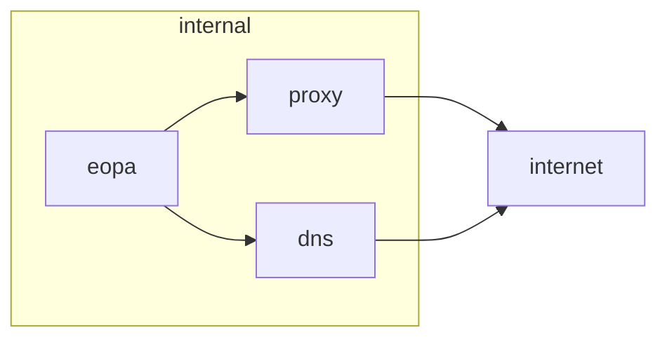

# Proxying example for Enterprise OPA

This demo setup is using docker compose to set up the following:



Enterprise OPA is started with
1. HTTP_PROXY and HTTPS_PROXY set to `proxy:3128`
2. `/etc/resolv.conf` including both the Docker DNS and the DNS proxy
3. **No direct access to the public internet.**

When starting the stack with `docker compose up`, we'll find Enterprise OPA starting up:

```raw
enterprise-opa-1  | {"level":"debug","msg":"Server initialized.","time":"2024-08-12T09:49:01Z"}
```

Requests to the internet to verify the license go through the proxy.
